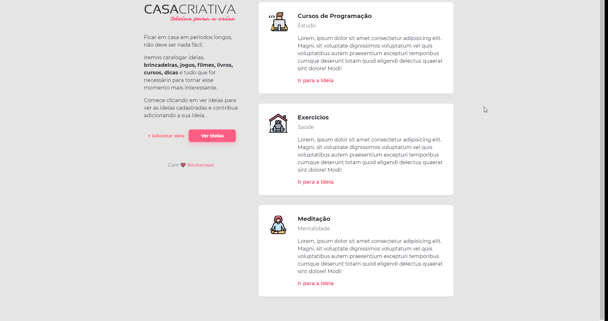

<h1 align="center">
    
</h1>

  

  
  
  

  

  

  <a href="#-tecnologias">Tecnologias</a>&nbsp;&nbsp;&nbsp;|&nbsp;&nbsp;&nbsp;
  <a href="#-projeto">Projeto</a>&nbsp;&nbsp;&nbsp;|&nbsp;&nbsp;&nbsp;
  <a href="#-layout">Layout</a>&nbsp;&nbsp;&nbsp;|&nbsp;&nbsp;&nbsp;
  <a href="#-como-contribuir">Como contribuir</a>&nbsp;&nbsp;&nbsp;|&nbsp;&nbsp;&nbsp;
  <a href="#-licença">Licença</a>

 

  

---

## 📖 Sobre

Sistema para cadastrar ideias enquanto ficamos confinados em casa para superar a crise do [Corona Vírus](https://www.worldometers.info/coronavirus/) 😷

## 🚀 Tecnologias

Esse projeto foi desenvolvido com as seguintes tecnologias:

- [CSS](https://www.w3schools.com/css/css_website_layout.asp)
- [HTML](https://www.w3schools.com/howto/howto_website.asp)
- [JavaScript](https://www.javascript.com/)

## 🤖 Resultado

## 🤔 Como contribuir

- Faça um fork desse repositório;
- Cria uma branch com a sua feature: `git checkout -b minha-feature`;
- Faça commit das suas alterações: `git commit -m 'feat: Minha nova feature'`;
- Faça push para a sua branch: `git push origin minha-feature`.

Depois que o merge da sua pull request for feito, você pode deletar a sua branch.

## 🧾 Licença

Esse projeto está sob a licença MIT. Veja o arquivo [LICENSE](LICENSE.md) para mais detalhes.

---

Feito com 💗 by [Raphael Barreto](https://www.linkedin.com/in/raphael-barreto-15631747/)